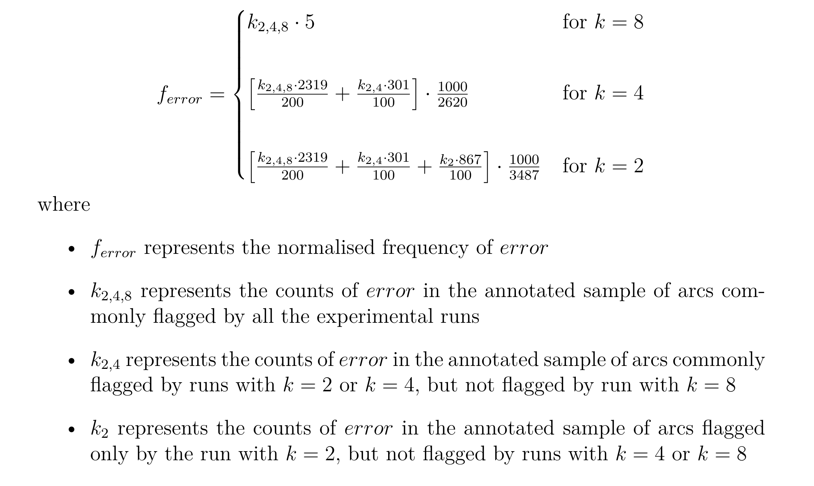

<h1>Annotations Directory</h1>

<h3>Contents</h3>

1. [allArcs](#allArcs)
2. [testArcs](#testArcs)
3. [Annotation Format](#annotation-format)
4. [Statistics Helper Files](#statistics-helper-files)

<h3>allArcs</h3>

For documentation of [normalizedScores.tsv](./allArcs/normalizedScores.tsv) file in this directory, refer [here](#statistics-helper-files).

This folder contains the manual annotation of the 0-scored arcs identified across different CV runs as per the format illustrated
[here](#annotation-format). The arc distribution in different files are as follows:

    k_all_200.tsv       Arcs that are present across all the different k-values in CV run.
                        Total Counts = 200
                    
    k_4not8_100.tsv     Arcs that are present in k=4 or k=2 CV run, but not in k=8 CV run.
                        Total Counts = 100
                        
    k_2not4_100.tsv     Arcs that are present in k=2 CV run, but not in k=4 or k=8 CV run.
                        Total Counts = 100  

<h3>testArcs</h3>

For documentation of [comparisonStats.tsv](./testArcs/comparisonStats.tsv) file in this directory, refer [here](#statistics-helper-files).

This folder contains the manual annotation of the 0-scored arcs identified in `test` set of UDv2.4 hi-HDTB treebank across either of CV or baseline runs,
as per the format illustrated [here](#annotation-format). The arc distribution in different files are as follows:

    base_allZero.tsv    All 0-scored arcs as discovered in baseline run
     
    base_not_k.tsv      0-scored arcs as discovered in baseline run, unique to the run, and not 
                        discovered by the CV run
    
    k_not_base.tsv      0-scored arcs as discovered in CV run, unique to the run, and not
                        discovered by the baseline run
    
    test_k{x}.tsv       0-scored arcs as discovered in CV run, when k={x}

<h3>Annotation Format</h3>

The files in the directories are annotated in the following tsv format, with one token per line.

    <Sentence-ID>   <Token-ID>  <Error Typology>

<h3>Statistics Helper Files</h3>

There are two files that are generated based on the annotations from the directories, and are used for generative evaluation
statistics. These files are eventually used to generate [stats.md](../stats.md) file.

1. [allArcs/normalizedScores.tsv](./allArcs/normalizedScores.tsv)  
Since the manual annotation in the other files in the [allArcs](./allArcs) directory is done on an unequal number of instances,
this file calculates the normalized scores calculated over 1000 arcs to allow effective comparison of the different CV runs.
The following are the formulae used for calculating normalized scores:

    

2. [testArcs/comparisonStats.tsv](./testArcs/comparisonStats.tsv)  
Based on the manual annotation of the 0-scored arcs found in `test` set of UDv2.4 hi-HDTB treebank, this file
compares the frequency of different error typologies as discovered across baseline and CV runs of LISCA.