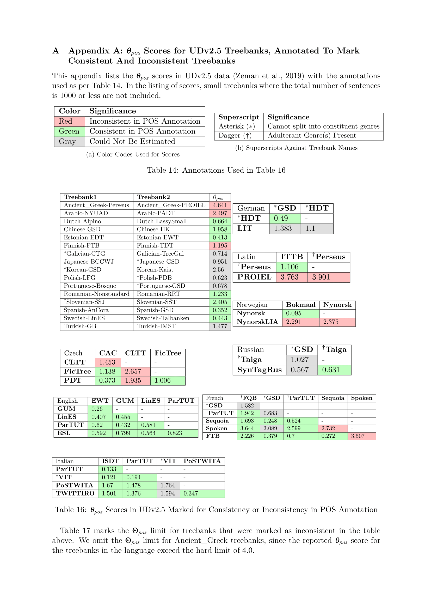
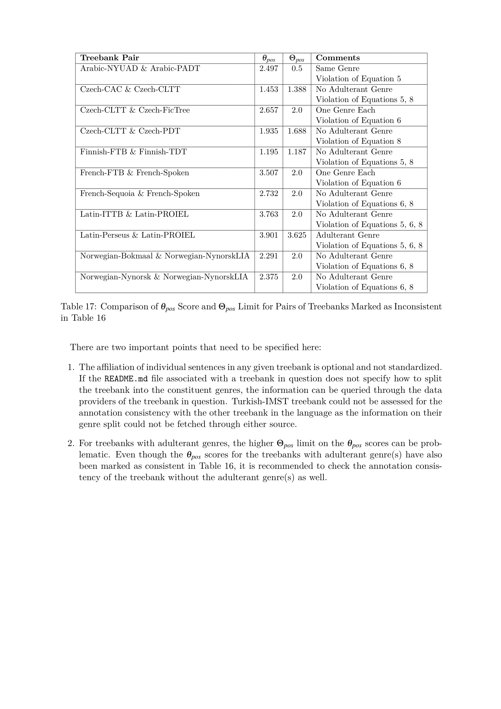

<h1>Estimating POS Annotation
Consistency of Different
Treebanks in a Language</h1>

<h3>Contents</h3>

1. [Documentation](#documentation)
2. [Abstract](#abstract)
3. [Included Files](#included-files)
4. [Using This Module](#using-this-module)
5. [Results on UDv2.5 Data](#results-on-udv25-data)
6. [References](#references)

<h3>Documentation</h3>

For documentation, please refer to Chapter 4 of the thesis document. 

[//]: # "[thesis document](../docs/thesis.pdf)."

<h3>Abstract</h3>

We introduce a new symmetric metric (called θpos) that utilises the non-symmetric KLcpos3 metric
to allow us to compare the annotation consistency between different annotated treebanks of a given language, when annotated 
under the same guideline. We can set a maximal value threshold for this new metric so that a pair of treebanks can be considered 
harmonious in their annotation consistency if θpos value surpasses this threshold. For the calculation of the threshold,
we estimate the effects of

1. the size variation, and 
2. the generic distribution of data 

in the treebanks of the considered pair on the θpos metric. The estimations are based on data from treebanks of 
distinct language families, making the threshold language-independent. Extensible to any given guideline, we demonstrate 
the utility of the proposed metric by listing the treebanks in Universal Dependencies version 2.5 (UDv2.5) data that are 
annotated consistently with other treebanks of the same language.

<h3>Included Files</h3>

1. [docs/*](./docs): Files used for documentation
2. [scripts/*](./scripts): Scripts used in the experiment. Refer [here](./scripts/README.md) for details.
3. [treebanks_to_compare.tsv](./treebanks_to_compare.tsv): File generated when [treebanks_to_compare.sh](./scripts/treebanks_to_compare.sh) is run on 
UDv2.5 data.
4. [UDv2.5_scores.tsv](./UDv2.5_scores.tsv): Contains θpos score for different treebanks across different languages in
UDv2.5. Treebank marked with `False` value in [treebanks_to_compare.tsv](./treebanks_to_compare.tsv) file are not included in
computation of the score.

<h3>Using This Module</h3>

To start with the module, clone this repository in your system, and then run the commands as required:

    make getdata
 Downloads the required dependencies using `requirements.txt` file, UDv2.5 data using the link
 [here](https://lindat.mff.cuni.cz/repository/xmlui/handle/11234/1-3105) and then prepares working 
 copies of the treebanks in the current directory. Also invoked with any other command to make sure
 the data is correctly in place.

    make all_scores
 Get θpos scores for all the treebank combinations in UDv2.5 in TSV format. Results stored
 in [UDv2.5_scores.tsv](./UDv2.5_scores.tsv) file.

    make size_control
 Get θpos and coverage scores for Czech-PDT and Estonian-EDT data, to study the variance of θpos with respect
 to the change in size of dataset. Results stored in [size_control](./size_control) directory.
 
    make get_trigrams
 Get the variance of POS trigrams over the change in dataset size for Czech-PDT and Estonian-EDT data. Generates [unique_trigrams](./unique_trigrams) directory
 and plots the results therein. The generated plots are saved in [docs](./docs) directory.
 
    make genre_control
 Get the variance of θpos score across different genres in Polish-LFG and Finnish-TDT data. Generates [genre_control](./genre_control) directory.
 
    make genres_additive
 Get the variance of θpos score when genres are added, with data from Polish-LFG dataset. Generates [genre_control/genres_additive](./genre_control/genres_additive)
 directory.
    
    make clean
 Removes the generated files and folders in the directory.
 
<h3>Results on UDv2.5 Data</h3>

<h3>References</h3>

1. Rudolf Rosa and Zdeněk Žabokrtský. KLcpos3 - a Language Similarity Measure
for Delexicalized Parser Transfer. In <i>Proceedings of the 53rd Annual Meeting of
the Association for Computational Linguistics and the 7th International Joint
Conference on Natural Language Processing (Volume 2: Short Papers)</i>, pages
243–249, Beijing, China, July 2015. Association for Computational Linguistics.
doi: https://doi.org/10.3115/v1/P15-2040. 
URL https://www.aclweb.org/anthology/P15-2040.

2. Prafulla Kalapatap, N. N. Tejas, Siddharth Dalmia, Prakhar Gupta, Bhaswant
Inguva, and Aruna Malapati. A Novel Similarity Measure: Voronoi Audio
Similarity for Genre Classification. <i>International Journal of Intelligent Systems
Technologies and Applications</i>, 16(4):309–318, January 2017. ISSN 1740-8865.
doi: https://doi.org/10.1504/IJISTA.2017.088054. 

3. Elias Pampalk, Arthur Flexer, and Gerhard Widmer. Improvements of Audio-
Based Music Similarity and Genre Classificaton. In <i>ISMIR</i>, volume 5, pages
634–637. London, UK, 2005.

4. Ricardo Casañ-Pitarch. A Proposal for Genre Analysis: The AMS model. In
Chelo Vargas-Sierra, editor, <i>Professional and Academic Discourse: an Interdisciplinary
Perspective</i>, volume 2 of <i>EPiC Series in Language and Linguistics</i>,
pages 235–246. EasyChair, 2017. doi: https://doi.org/10.29007/hbg9. URL 
https://easychair.org/publications/paper/b6rp

5. Douglas Biber. A typology of English texts. <i>Linguistics</i>, 27(1):3–44, 1989. ISSN
0024-3949. doi: https://doi.org/10.1515/ling.1989.27.1.3.

6. Douglas Biber. <i>Variation across speech and writing</i>. Cambridge University Press,1991.

7. Douglas Biber. <i>Dimensions of Register Variation: A Cross-Linguistic Comparison</i>. Cambridge University Press, 1995.

8. Francis Heylighen and Jean-Marc Dewaele. Formality of Language: definition,
measurement and behavioral determinants. <i>Interner Bericht, Center “Leo
Apostel”, Vrije Universiteit Brüssel</i>, 4, 1999.

9. Alejandro Mosquera and Paloma Moreda Pozo. The Use of Metrics for Measuring
Informality Levels in Web 2.0 Texts. In <i>Proceedings of the 8th Brazilian
Symposium in Information and Human Language Technology</i>, 2011. URL
https://www.aclweb.org/anthology/W11-4523.

10. Zeman, Daniel; Nivre, Joakim; Abrams, Mitchell; et al., 2019, 
  Universal Dependencies 2.5, LINDAT/CLARIAH-CZ digital library at the Institute of Formal and Applied Linguistics (ÚFAL), Faculty of Mathematics and Physics, Charles University, 
  http://hdl.handle.net/11234/1-3105.
